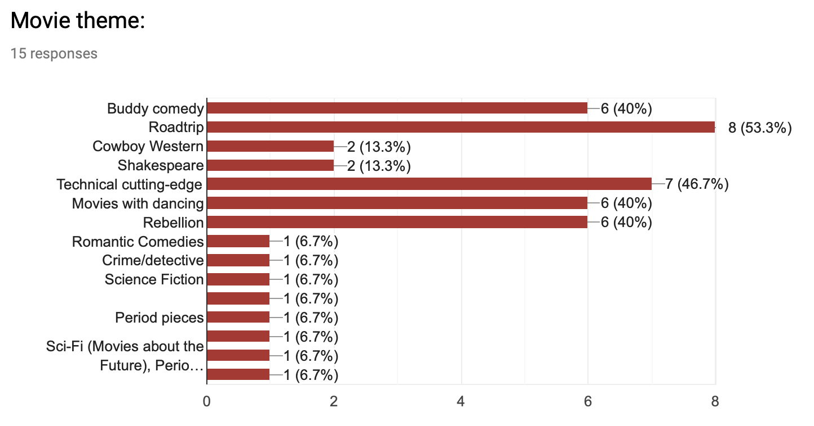

```{r setup, include=FALSE}
knitr::opts_chunk$set(echo = FALSE)

library(dplyr)
library(ggplot2)
library(gt)
library(tibble)
library(tidyr)
```

## The Concept

For a long time, I've thought a great idea for a movie club would be to watch movies from decades past. You could travel back in time and watch films from exactly 20 years ago for example. Or 30 years, or 40 years. You would get this small slice of film history to browse through, a 12-month time-capsule defined in relation to the present. And each new year you could browse the next slice of history.

One way to implement this is to spread the selections across many decades, picking 1 film from each decade's annual time-capsule. Here are the time-capsule years for 2019:

```{r, fig.height=1.5, fig.width=7}
years <- seq(1929, 2019, by = 10)
data <- tibble(
  year = seq(1920, 2020),
  y = 0,
  selected = year %in% years
)
size <- 18
ggplot(data, aes(year, y)) +
  geom_line(size = size, color = "grey60") +
  geom_segment(data = filter(data, selected == TRUE),
               aes(x = year, xend = year + 1, y = y, yend = y),
               size = size, color = "blue4") +
  geom_segment(x = 2019, xend = 2020, y = 0, yend = 0, 
               size = size, color = "blue") +
  geom_text(data = filter(data, selected == TRUE),
            aes(x = year, y = 0, label = year), 
            color = "blue4", size = 4, hjust = 0.5, vjust = -3) +
  scale_y_discrete(expand = expand_scale(mult = c(1, 2))) +
  scale_x_continuous(expand = expand_scale(add = 4),
                     breaks = seq(1920, 2020, by = 10)) +
  labs(x = "year", y = NULL) +
  theme_minimal(10) +
  ggtitle("TTMV 2019: Time-Capsule Years") +
  theme(plot.title = element_text(hjust = 0.5, size = 10))
```

Sounds like a good excuse to watch great movies! Why not make it into a  club, in a very real and non-binding sense^[requiring not much of anything but some reading of [IMDB](https://www.imdb.com) and watching movies]? An experiment in temporal film discovery. The **Time Travel Movie Club**. Over the course of a year, we sample from 10 decades of film, 1 film per month^[With our extra two months at the end of the year, we get two "wild cards" to pick from any year we want]. The 2019 schedule looks like this:

```{r layout="l-body-outset", fig.height=1.5, fig.width=7}
data <- tibble(
  month = month.abb,
  film_year = c(years, "????", "????")
)

data %>% 
  spread(key = month, value = film_year) %>% 
  select(!!month.abb) %>% 
  mutate(rowname = "film year") %>% 
  gt(rowname_col = "rowname") %>%
  tab_header(
    title = "TTMC 2019 Schedule"
  )
```


## Theme of the Year

But obviously we need *more* Arbitrary Constraints®! There are too many wonderful films to choose from, even in our year long time-capsules^[for example, [1939](https://www.imdb.com/search/title?year=1939&title_type=feature&) is considered by some to be the single greatest year of cinema!]. So let's pick a theme to adhere to -- i.e. some (loose) guiding star to steer by as we float down the decades. 

To decide on a theme for the first year of **T.T.M.C.**®^[not actually trademarked, but now I know the keyboard shortcut], I asked some friends to help^[thanks friends!!!]. The chart below tallies survey results from some proposed themes (and a few write-ins)^[note: people could vote for more than one theme, and they were *instructed* to vote for two]. 

```{r layout="l-body-outset", fig.height=4, fig.width=7}

```

And the winner is.......**Roadtrip**! A journey through time and space. Sometimes with a clear destination, sometimes more of a dander^[dander: a wander with purpose.], but very often transformative to the participants. Think [O Brother, Where Art Thou?](https://www.imdb.com/title/tt0190590), [It Happened One Night](https://www.imdb.com/title/tt0025316), [Little Miss Sunshine](https://www.imdb.com/title/tt0449059), and [The Lord of the Rings](https://www.imdb.com/title/tt0120737).
Over the course of the year, we'll have to dig in and explore this theme in more detail, but I think we have some good films in store. 

<aside>
```{r}
knitr::include_graphics("images/road-trip-sign.jpg")
```
</aside>

```{r layout="l-body", fig.height=4, fig.width=7, fig.cap="Photo by Nextvoyage from Pexels"}
knitr::include_graphics("images/road-trip-road.jpg")
```


## To Be Continued...

So stay tuned and join us on this journey through 10 decades of film! We'll be viewing at 12 films-per-year, 24 frames-per-second. I'll be posting January's 1929 selection shortly!

