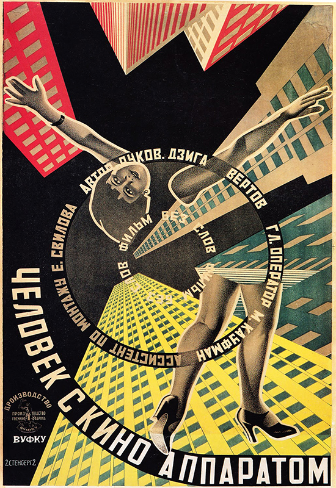
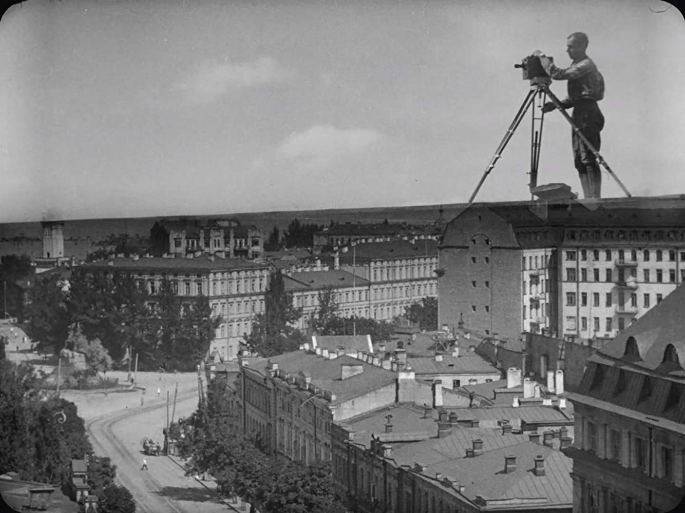
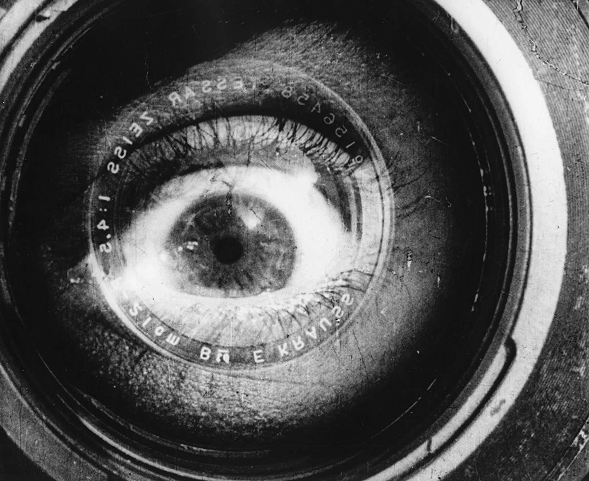

```{r setup, include=FALSE}
knitr::opts_chunk$set(echo = FALSE)
```

# Our First Month

It's the very first month of the **Time Travel Movie Club**, and for January we are opening up the film time-capsule from 1929. And to plot a course, we're navigating by our *Road Trip* theme for 2019. 

The year 1929 saw the release of such films as the detective thriller [Bulldog Drummond](https://www.imdb.com/title/tt0019735) and the musical comedy [Cocoanuts](https://www.imdb.com/title/tt0019777). I recommend checking out IMDB's [1929 list](https://www.imdb.com/search/title?year=1929&title_type=feature) for the movie posters alone^[check out [Hallelujah](https://www.imdb.com/title/tt0019959/mediaviewer/rm577073664)!]. And just as this is our inaugural year for movie time-travel, 1929 also boasted the [very first](https://www.oscars.org/oscars/ceremonies/1929) Academy Awards, honoring films released between August 1, 1927 and August 1, 1928^[the Oscars changed their schedule in [1935](https://www.oscars.org/oscars/ceremonies/1935) to be hosted early in the year and review movies from the entire, previous calendar year (thank goodness)]. 

<aside>
```{r}
knitr::include_graphics("images/Academy_Award_trophy.jpg")
```
</aside>


## The 1929 Selection

For our 1929 time-capsule selection, we are watching...

[**Man With a Movie Camera**](https://www.imdb.com/title/tt0019760/),
By Dziga Vertov, Edited by Elizaveta Svilova. <br><br>
This avant garde Soviet film is considered one of the most influential and groundbreaking films in cinema history. It is famous for the virtuosic cinematic techniques invented or deployed in the film, such as: multiple exposure, fast motion, slow motion, freeze frames, match cuts, jump cuts, split screens, Dutch angles^[[a.k.a.](https://en.wikipedia.org/wiki/Dutch_angle) Dutch tilt, canted angle, or oblique angle....in other words, rotating the camera - and spoiler, "Dutch" actually refers to German!], extreme close-ups^[further explored by [Wayne's World](https://www.youtube.com/watch?v=BYu_N2Fb2Vc)], tracking shots, reversed footage, and stop motion animation. [This article](https://www.bfi.org.uk/news-opinion/news-bfi/features/five-wonderful-effects-man-movie-camera) touches on a few of these techniques and shows some sample clips. <br> <br> 
It is ambitiously avant garde.  This film is perhaps more remarkable for the degree it is NOT like other movies from 1929 - or indeed, of any year - than that it is representative of that year.

<aside>
```{r, fig.cap="From [IMDB](https://www.imdb.com/title/tt0019760)"}

```
</aside>

```{r, fig.cap="From IMDB: https://www.imdb.com/title/tt0019760"}

```

As Vertov proclaimed:

> The film 'Man with a Movie Camera' represents  
AN EXPERIMENTATION IN THE CINEMATIC COMMUNICATION  
Of visual phenomena  
WITHOUT THE USE OF INTERTITLES  
(a film without intertitles)  
WITHOUT THE HELP OF A SCENARIO  
(a film without a plot)  
WITHOUT THE HELP OF THEATRE  
(a film without actors, without sets, etc.)  
>
> This new experimentation work by Kino-Eye is directed towards the creation of an authentically international absolute language of cinema on the basis of its complete separation from the language of theatre and literature.

Spicy! A provocative choice for our theme. We can discuss if you all think it also deserves to be considered a creation of the *absolute language* of a road trip film, divorced from the "language of theater and literature" that Vertov talks about. In that way, it will be a perfect opening film of the series, as it will force us to confront 'what does it actually mean for a film to be a road trip film?'

#### What is a Road Trip Film?

Sometimes, a road trip is an excuse (or a mission) to get from point A to point B. Other times, it's more of an open-ended wandering. But it seems it is always about *travelling* -- moving, either from or to something, along a path. A story can unfold on this path, with the path often becoming a character in and of itself. This physical travel can mirror the metaphorical journey that characters are on, but actual movement is key. And movement, motion, is key to the medium of film -- the language of cinemena, separate from theater and literature, that Vertov was so into. Beyond plot and characters, he was interested in exploring visual techniques, images, and movement -- this is the underlying language of movies, and just like our theme, it's not the destination that matters but the experience of getting there.

#### Watching

You can find the full 68min movie [online here](https://en.wikipedia.org/wiki/File:Man_With_A_Movie_Camera_(Dziga_Vertov,_1929).webm). This is a silent film, but these were typically screened with musical accompaniment from an organ or orchestra. We strongly recommend following suit on this and adding music while you watch. One wonderful musical pairing is Shostakovich's Symphony No. 3, which was composed in 1929. 

<aside>
```{r, fig.cap="From [IMDB](https://www.imdb.com/title/tt0019760)"}

```
</aside>

## Road Trip Games

Road trips can be boring^[or, say, watching a 68min avant garde silent documentary film :)]. Wouldn't it be nice to have some games to play to help pass the time? Well you're in luck! Now you can play **Road Trip Movie Bingo**. Below is a sample card, and you can download 5 different cards [here](road-trip-bingo.zip) to play along at home while you watch this year's **T.T.M.C.** films.

```{r}
knitr::include_graphics("images/road-trip-bingo.png")
```

## Acknowledgments {.appendix}

Thanks so much to Ben, our resident classic-cinema expert, for choosing the film and writing up much of this post.
