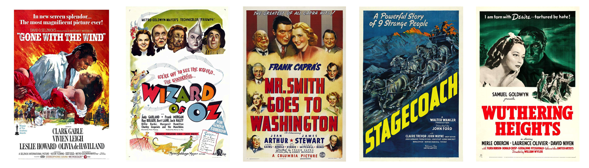
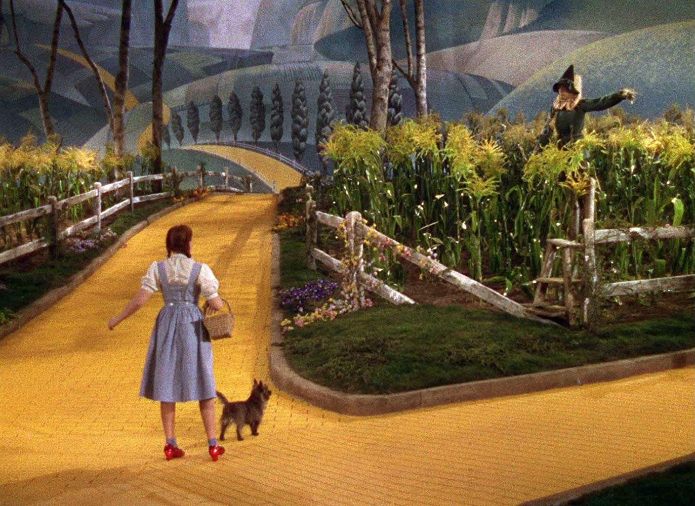
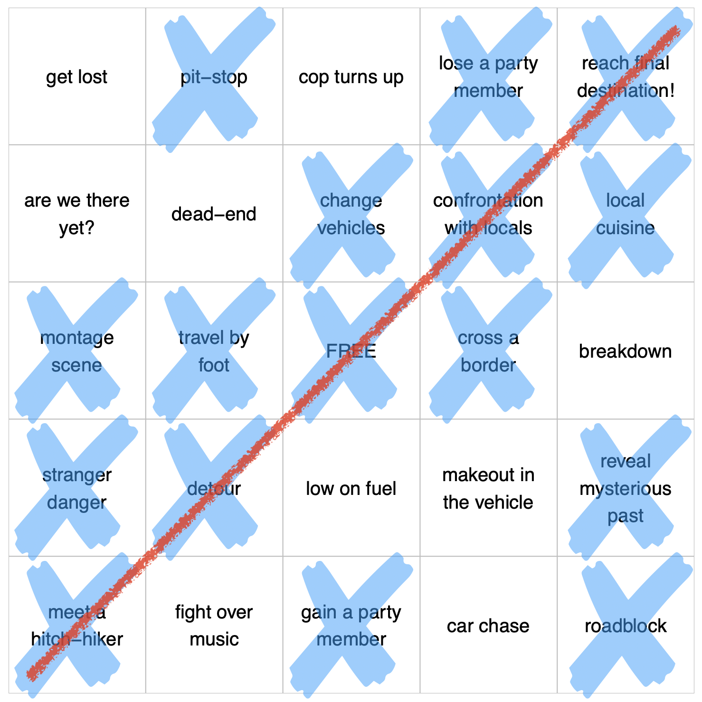
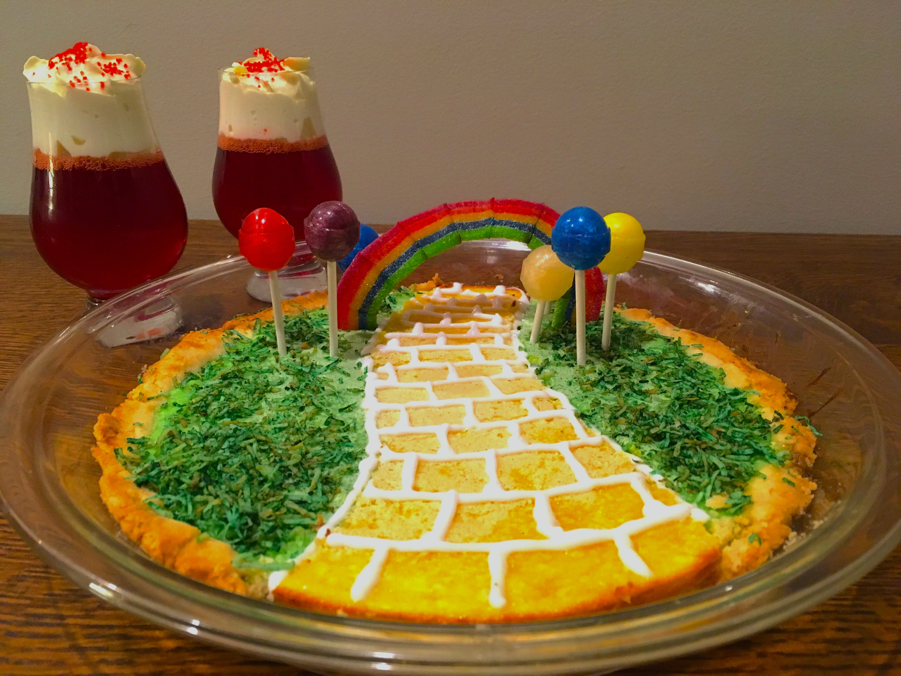

```{r setup, include=FALSE}
knitr::opts_chunk$set(echo = FALSE)
```

# The Greatest Year

In our second time-capsule movie month, we are traveling to [1939](https://www.imdb.com/search/title?year=1939&title_type=feature). Some see this year, at the height of the Golden Age of Hollywood cinema, as the single greatest in film history^["The year 1939 in film is widely considered the most outstanding one ever" - Wikipedia, [1939 in film](https://en.wikipedia.org/wiki/1939_in_film)]. As one piece of evidence for this, the American Film Institute's (AFI) original [Top 100 movie list](https://www.afi.com/100Years/movies.aspx) boasted five films from 1939^[AFI's [100 Years...100 Movies](https://www.afi.com/100Years/movies.aspx) list had 5 films from 1939: Gone With The Wind (#4), The Wizard Of Oz (#6), Mr. Smith Goes To Washington (#29), Stagecoach (#63), and Wuthering Heights (#73)], the most of any year and the only year to have two pictures in the top ten.

```{r map-types, fig.width=7, fig.height=2, echo=FALSE, eval=FALSE, layout="l-body-outset"}
library(ggplot2)
library(patchwork)

mr_smith <- jpeg::readJPEG(file.path("images", "mr-smith.jpg"))
gone_with_the_wind <- jpeg::readJPEG(file.path("images", "gone-with-the-wind.jpg"))
the_women <- jpeg::readJPEG(file.path("images", "the-women.jpg"))
wuthering_heights <- jpeg::readJPEG(file.path("images", "wuthering-heights.jpg"))
stagecoach <- jpeg::readJPEG(file.path("images", "stagecoach.jpg"))
wizard_of_oz <- jpeg::readJPEG(file.path("images", "wizard-of-oz-poster.jpg"))
# build plots
theme_size <- 6
gg_smith <- ggplot() + theme_minimal(theme_size) +
  annotation_custom(grid::rasterGrob(mr_smith, interpolate = TRUE), 
                    xmin = -Inf, xmax = Inf, ymin = -Inf, ymax = Inf)
gg_gone <- ggplot() + theme_minimal(theme_size) +
  annotation_custom(grid::rasterGrob(gone_with_the_wind, interpolate = TRUE), 
                    xmin = -Inf, xmax = Inf, ymin = -Inf, ymax = Inf)
gg_women <- ggplot() + theme_minimal(theme_size) +
  annotation_custom(grid::rasterGrob(the_women, interpolate = TRUE), 
                    xmin = -Inf, xmax = Inf, ymin = -Inf, ymax = Inf)
gg_wuthering <- ggplot() + theme_minimal(theme_size) +
  annotation_custom(grid::rasterGrob(wuthering_heights, interpolate = TRUE), 
                    xmin = -Inf, xmax = Inf, ymin = -Inf, ymax = Inf)
gg_stagecoach <- ggplot() + theme_minimal(theme_size) +
  annotation_custom(grid::rasterGrob(stagecoach, interpolate = TRUE), 
                    xmin = -Inf, xmax = Inf, ymin = -Inf, ymax = Inf)
gg_wizard <- ggplot() + theme_minimal(theme_size) +
  annotation_custom(grid::rasterGrob(wizard_of_oz, interpolate = TRUE), 
                    xmin = -Inf, xmax = Inf, ymin = -Inf, ymax = Inf)
# patchwork
gg_gone + gg_wizard + gg_smith + gg_stagecoach + gg_wuthering + 
  plot_layout(nrow = 1)
ggsave("images/film-selections.png", height = 2, width = 7)
```

```{r map-types-show, echo=FALSE, layout="l-body-outset", fig.cap="Source images from [IMDB](https://www.imdb.com)"}

```

It was a year that helped define the archetypes and structure of multiple genres (period epic, romantic drama, fantasy, western) for decades to come. Within that year lie some of the foundational building blocks of modern cinema.

For our 1939 road-trip pick, we *could* easily go with [*Stagecoach*](https://www.imdb.com/title/tt0031971), the movie that redefined the Western from B-movie to serious film and helped launched John Wayne's career as a leading man. There's certainly a lot of road in the film, as an odd amalgam of travelers ride the trail, each cultivating their own ambitions while collectively avoiding Geronimo's war party. It's totally a road-trip movie *and* a trail-blazer in the genre (though the plot is a bit disjointed). But for us, there's an even better pick - one with an iconic road-trip party, with pit-stops and hitch-hikers, with transformative travel, and of course great music...

<aside>
```{r, fig.cap="From [IMDB](https://www.imdb.com/title/tt0031971)"}
knitr::include_graphics("images/stagecoach-wagon.jpg")
```
</aside>


# The 1939 Selection

For our 1939 time-capsule selection, we are watching...<br><br>
[**The Wizard of Oz**](https://www.imdb.com/title/tt0032138),
Directed by Victor Fleming, from the book by L. Frank Baum.  
Starring Judy Garland, Frank Morgan, Ray Bolger, Bert Lahr, Jack Haley.<br><br>
This beloved fantasy is one of the most iconic films in history, and it's a perfect road-trip movie! Based on the wildly popular childrens books by L. Frank Baum, the story of Dorothy comes to life through incredibly detailed costumes, Oscar winning original music^[The Wizard of Oz won two Oscars at the [12th Academy Awards](https://www.oscars.org/oscars/ceremonies/1940), one for Original Score and another for Original Song (for "Over the Rainbow").], and vivid [Technicolor](https://en.wikipedia.org/wiki/Technicolor) film. It's one of the most quotable films according to [AFI's list](https://www.afi.com/100Years/quotes.aspx), bested in quantity only by Casablanca, and [AFI ranked](https://www.afi.com/100Years/songs.aspx) "Over the Rainbow" as the best movie song of all time. It's fantastical and imaginative (and surprisingly scary at times) and an all-around wonderful film. 

<aside>
```{r, fig.cap="From [IMDB](https://www.imdb.com/title/tt0032138)"}
knitr::include_graphics("images/wizard-of-oz-poster-drawing.jpg")
```
</aside>

> Toto, I've a feeling we're not in Kansas anymore.

```{r, fig.cap="From [IMDB](https://www.imdb.com/title/tt0032138)"}

```


### History and Quirks

The AFI article [here](https://catalog.afi.com/Catalog/moviedetails/7892) provides some great history on the film. A bit surprisingly, The Wizard of Oz lost money at the box office originally, though it was critically well received. It was apparently the most expensive film yet for Metro-Goldwyn-Mayer (MGM), and it grossed ~$3M (~$54M today) but lost ~$1M in its first release^[There's a great write-up on the history of The Wizard of Oz on the AFI website [here](https://catalog.afi.com/Catalog/moviedetails/7892)]. It was made profitable later on in its re-release in 1948-1949.

The story of the directors is an interesting one. Victor Fleming was the main director, although he left before the end of filming to take over direction of *Gone With The Wind* (for which he won the Oscar for Best Director). Another famed MGM director, King Vidor, stepped in to take Fleming's place, and Vidor filmed most of the sepia-tone black and white scenes, including the iconic cyclone and Judy Garland's performance of "Over The Rainbow". On *Gone With The Wind*, Fleming had taken over from George Cukor, another big named director, who ironcically had been the previous director for *The Wizard of Oz* before filming started.

The costumes and make-up for the film were incredible, but they sounded like hell to deal with. The original Tin-Man, Buddy Ebsen, had to quit because of a severe allergic reaction to the aluminum powder used in his make-up. The Wicked Witch's (Margaret Hamilton) copper-based make-up was also fairly toxic, and somewhat flameable, as she suffered fairly severe burns filming her flaming exit from Munchkinland. But on a lighter note, apparently the *horse of a different color* scene used "practical effects" and colored live, white horses with Jell-O powder -- the main challenge was filming them quickly, before the horses started licking off the Jell-O!

<aside>
```{r, fig.cap="From [cellcode.us](https://cellcode.us/quotes/gif-wizard-oz-horse-different-color.html)"}
knitr::include_graphics("images/horse-of-a-different-color.jpg")
```
</aside>

I particularly enjoyed this collection of non-sequitur trivia quirks from that article:

> A quarter-mile cable tunnel under the studio was used to record the echo of “The Wizard's” voice. The wings of a giant condor were borrowed from a museum for the production, and a mathemetician of renown, O. O. Ceccarini, was hired to devise an appropriate noise to represent the center of the cyclone.


### Yellow Brick Road Trip

So what makes our selection a road-trip movie? Well, you know it's a good sign when the road has its own name and [Wikipedia page](https://en.wikipedia.org/wiki/Yellow_brick_road). Oz even has its own map and flag!

```{r oz-pics, fig.width=7, fig.height=2.5, echo=FALSE, eval=FALSE}
library(ggplot2)
library(patchwork)

oz_map <- jpeg::readJPEG(file.path("images", "oz-map.jpg"))
oz_flag <- png::readPNG(file.path("images", "oz-flag.png"))
# build plots
theme_size <- 6
gg_map <- ggplot() + theme_minimal(theme_size) +
  annotation_custom(grid::rasterGrob(oz_map, interpolate = TRUE), 
                    xmin = -Inf, xmax = Inf, ymin = -Inf, ymax = Inf)
gg_flag <- ggplot() + theme_minimal(theme_size) +
  annotation_custom(grid::rasterGrob(oz_flag, interpolate = TRUE), 
                    xmin = -Inf, xmax = Inf, ymin = -Inf, ymax = Inf)
# patchwork
gg_map + gg_flag + plot_layout(nrow = 1)
ggsave("images/oz-map-and-flag.png", height = 2.5, width = 7)
```

```{r oz-pics-show, echo=FALSE, layout="l-body-outset", fig.cap="Source images from [IMDB](https://en.wikipedia.org/wiki/Land_of_Oz)"}
knitr::include_graphics("images/oz-map-and-flag.png")
```

And for **Exhibit B**(-i-n-g-o), I'll direct you to the image below.

**ROAD-TRIP BINGO!**

```{r}

```

*The Wizard of Oz* has a traveling party, on a mission with a clear *destination*, walking a defined *path*, and spending the majority of their time *traveling*. And though each of them has a clear goal and ambition lying at the end of their road, it's their journey that brings them their rewards -- well, along with the help of some superficial signifiers from that expert con(fidence) man, the Wizard of Oz. The Scarecrow finds that he had brains all along, he just needed a diploma to show it. The Tin-Man discovers he had his heart, he just needed a testimonial to honor it. The Lion realizes he's been full of courage, he just needed a medal to celebrate it. And for Dorothy, she re-discovers the value of the home and family she ran away from -- she just needed Glinda to tell her how to work those dang ruby slippers! You might say they had it in them *all along*... And you'd be wrong. In reality, they developed these abilities over the course of their **road-trip** and friendship together. 

<aside>
```{r, fig.cap="From [IMDB](https://www.imdb.com/title/tt0032138)"}
knitr::include_graphics("images/group-traveling.jpg")
```
</aside>


And from our journey watching this month's selection, we didn't gain any Great and Powerful abilities of the head or heart or courage, but we did find some gifts for the stomach. I'll leave you with this beautiful shot of our home-made movie snacks - a yellow [lemon-bar](https://www.allrecipes.com/recipe/10294/the-best-lemon-bars/) brick road and ruby jello slippers. Happy time-traveling, everybody.

```{r}

```


