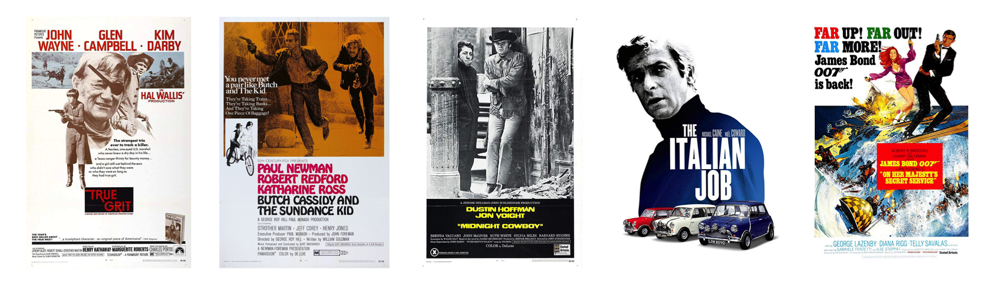
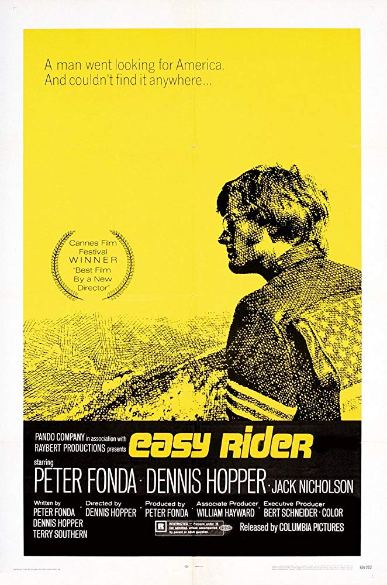
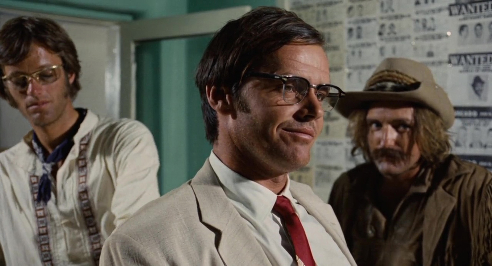

```{r setup, include=FALSE}
knitr::opts_chunk$set(echo = FALSE)
library(ttmc)
```

# The Times

```{r factoids}
factoid_table(
  year = params$year, 
  us_pres = "Richard M. Nixon",
  best_pic = "Midnight Cowboy",
  ticket_price = 1.42)
```

For `r params$month`, we land in groovy [`r params$year`](`r params$imdb_year_url`), a year famous for transition and cultural transformation in the US. In the world of cinema, cowboy's were still popular, with John Wayne back for his third decade as the grizzled old guard of the Western genre -- he pulled in the Oscar for Best Actor for his role in *True Grit*. Meanwhile the next generation was putting their own spin on things, with a young Paul Newman and Robert Redford keeping shoot-outs fun and funny in *Butch Cassidy and the Sundace Kid*. We also had *The Wild Bunch*, plus the Academy Award winner for Best Picture *Midnight Cowboy* as a "modern" western. The last decade also saw the start of James Bond^[modern cowboy?], this year with his 6th theatrical release *On Her Majesty's Secret Service* (and second actor, George Lazenby) -- as of 2019, Bond is the most prolific film franchise in history with 25 films^[Wikipedia [top film franchises](https://en.wikipedia.org/wiki/Film_series)]. Throw in some wonderful musical performances from Barbra Streisand in *Hello, Dolly!* and Lee Marvin (huh?) in *Paint Your Wagon*^[Cowboy Musical!], and we have an interesting year in film. To capture our road-trip theme and the cultural zeitgeist, we turned to a psychadelic picture from a first-time director...

```{r posters-build, eval=FALSE, fig.height=2, fig.width=7}
img_files <- list.files("images/posters", pattern = ".jpg", full.names = TRUE)
plot_posters(img_files)
ggplot2::ggsave("images/movie-posters.png", height = 2, width = 7)
```

```{r posters-show, layout="l-body-outset", fig.cap="Source images from [IMDB](https://www.imdb.com)"}

```


# The `r params$year` Selection

For our `r params$year` time-capsule selection, we are watching...<br><br>
[**`r params$movie`**](`r params$imdb_movie_url`),
Directed by Dennis Hopper, Starring Peter Fonda.<br><br>
If you search the [internet](https://www.imdb.com/imdbpicks/10-classic-road-trip-movies/ls061605763/mediaviewer/rm1719198976) [for](https://editorial.rottentomatoes.com/article/15-certified-fresh-road-trip-movies/) [classic](https://www.farandwide.com/s/best-road-trip-movies-8695ddcf658c44d8) [road-trip](https://www.businessinsider.com/23-best-road-trip-movies-of-all-time-2018-7#easy-rider-1969-5) [movies](https://filmschoolrejects.com/best-road-trip-movies/), you're basically guaranteed to find *Easy Rider* on any given list. It's quintasential road-trip -- two hippies make some money from a drug deal and celebrate by driving from LA to New Orleans to explore America. We're cruising the highways and backroads of the US from basically start to finish. It explores counter-culture and generational divides in the devisive melting-pot of America at the time (sound familiar?), all with fairly minimal plot but a heavy does of atmosphere, drug use, and cultural commentary. 

<aside>
```{r, fig.cap=glue::glue("From [IMDB]({url})", url = params$imdb_movie_url)}

```
</aside>

> A man went looking for America. And couldn't find it anywhere...

```{r, fig.cap=glue::glue("From [IMDB]({url})", url = params$imdb_movie_url), out.width="100%"}
knitr::include_graphics("images/clips/MV5BZTA1NzE2MzktYjZmMy00OTc3LTkxNDctYzc3YmYzYjliNTViXkEyXkFqcGdeQXVyNzM0MTUwNTY@._V1_SY1000_CR0,0,1477,1000_AL_.jpg")
```

It was made with lots of drugs and little money^[it still lost money at the box office] by Dennis Hopper, who wrote, directed, and co-starred with Peter Fonda. The two were nominated for Best Original Screenplay by the Academy that year, and Hopper won Best First Work at the Cannes Film Festival for his directorial debut^[IMDB: [Easy Rider awards](https://www.imdb.com/title/tt0064276/awards?ref_=tt_awd)].


### New Hollyood

Honestly as a movie it's pretty boring (kind of like a road-trip). But the broader story behind it is more interesting. It's seen as one of the main films to launch the era of "[New Hollywood](https://en.wikipedia.org/wiki/New_Hollywood)" in the 1970s. "Old Hollywood" with its large studio pictures was dying, with viewers being lost to TV. Either through a flowering of creativity from studios losing influence or from an economic adaptation to pull in younger audiences, movies were shifting to an era of the director -- new wave directors were given more agency to make more unique, risky films (often on smaller budgets). This was exemplified in the mid-70s with originals like *Taxi Driver*, *Paper Moon*, *Dog Day Afternoon*, and *Chinatown* -- it was a great period of film. 

Another redeeming gem of this movie is the great performance of a young Jack Nicholson. Look at that guy... What a character to meet on a road-trip.

```{r, fig.cap=glue::glue("From [IMDB]({url})", url = params$imdb_movie_url), out.width="100%"}

```

